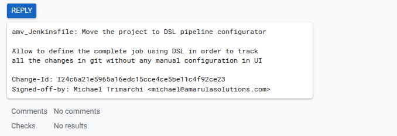
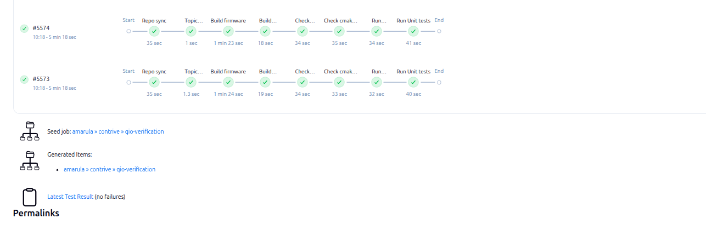
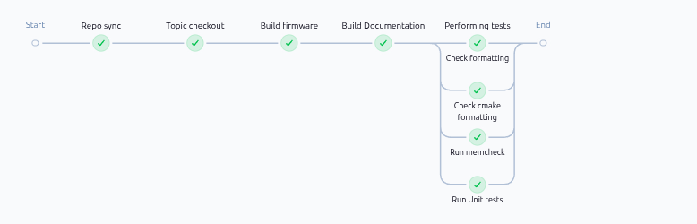

<!-- The content of the slide is handled by the layout -->

---

::title::

# What is Jenkins?

::body::

<div grid="~ cols-2 gap-4" style="grid-template-columns: 60% 40%">
<div>
<b>Jenkins</b> is an open-source automation server primarily used for continuous integration (CI) and continuous delivery (CD), streamlining the software development lifecycle. Allow us:
<br><br>
<ul>
<li><b>Prioritize Fixing Broken Builds:</b> Resolving broken builds must be a top priority for all team members.</li>
<li><b>Automate the Deployment Process:</b> The deployment process should be fully automated, eliminating all manual steps.</li>
<li><b>Emphasize High-Quality Testing:</b> All team members should focus on contributing to high-quality tests, as the reliability and integrity of the Continuous Integration (CI) process depend heavily on test quality.</li>
</ul>

</div>
<div>

</div>
</div>
<!--
The last comment block of each slide will be treated as slide notes. It will be visible and editable in Presenter Mode along with the slide. [Read more in the docs](https://sli.dev/guide/syntax.html#notes)
-->

---
transition: slide-left
---

::title::

# Jenkins Pipelines

::body::

Jenkins supports three main types of pipeline definitions: declarative, scripted, YAML. The first two rely on Groovy syntax.

<table>
<tr>
<th> YAML pipeline </th>
<th> Declarative pipeline </th>
</tr>
<tr>
<td>
```yaml
pipeline:
  agent:
    any:
  stages:
    - stage: "Hello"
      steps:
        - echo "Hello World"
```
</td>
<td>
```groovy
pipeline {
    agent any
    stages {
        stage('Hello') {
            steps {
                echo 'Hello World'
            }
        }
    }
}
```
</td>
</tr>
</table>

<!--
Here is another comment.
-->

---
transition: slide-left
---

::title::

# Jenkins pipeline are not just code

::body::

- Configuration of pipeline comes via GUI
    1. GUI does not scale
    2. Multiple people can play with GUI in the same time
- We can not track changes about configuration changes
    1. Not able to revert
    2. Not able to bisect the problem
    3. The changes are not reviewed and accepted
- ... or you can with **Jenkins Configuration Job Plugin**


---
transition: slide-left
---

::title::

# What was done (1) ?

::body::

We have created our shared library to allow us to define our pipelines using a common design. This make simple to setup most of our continue integration in a easy way.

```groovy
node('android-os-build') {
    def dockerImage = 'qio-builder:latest'
    def manifestUrl = "${GITEA_SSH_URL}/contrive/manifest.git"
    def credentials = ['c4f9fa8c-45d7-459e-a645-203f1245d914', '9af8a985-9516-467e-b9cb-0174692fe8c0']

    ...

    final def buildCode = [
        'Build firmware' : {
          ...
        },
        'Build Documentation' : {
          ...
        },
        'Performing tests' : {
            def stages = [:]
            ...
            parallel(stages)
        }
    ]
    def ver = new Verification(this, env, credentials)
    def options = ['dockerImage': dockerImage]
    ver.repoBuild(manifestUrl, buildCode, options)
}

```

<!--

-->

---
transition: slide-left
---

::title::

# What was done (2)?

::body::

We have add a way to define and create parameters in groovy as in declaritive pipeline.

````md magic-move
```groovy
 def ui = new Ui.Builder(this)
        .addStringParameter("BRANCH", "master", "Branch or tag to be built")
        .addStringParameter("GERRIT_TOPIC", '', "Gerrit Topic to cherry-pick.")
        .addBooleanParameter("KEEP_BUILD", false, "If you want to keep build select it")
        .addParameterSeparator('SEPARATOR_EMAIL', "Optional Email information", "border-width: 0",
                                    """
                                     background-color: #ef6667;
                                     text-align: center;
                                     padding: 4px;
                                     color: #343434;
                                     font-size: 22px;
                                     font-weight: normal;
                                     text-transform: uppercase;
                                     font-family: 'Orienta', sans-serif;
                                     letter-spacing: 1px;
                                     font-style: italic;
                                    """)
        .addStringParameter("Mailers", "", "Address to send emails")
        .addBooleanParameter("Email", false, "Send email with changelog and artifacts")
        .addMultilineStringParameter('Messagebody', body_template, 'Add the message that you would like to send to company')
        .build()
```
```groovy
parameters {
  booleanParam(name: 'BUILD_SDK', defaultValue: false, description: 'Build the SDK')
  booleanParam(name: 'KEEP_BUILD', defaultValue: false, description: 'Keep build')
  booleanParam(name: 'CLEAN_STATE_CACHE', defaultValue: true, description: 'Clean image build sstate cache')
  string(name: 'TAG_NAME', defaultValue: '', description: 'TAG_NAME to build')
  string(name: 'GIT_BRANCH', defaultValue: 'kirkstone', description: 'Git branch to checkout')
}
```
````

---
transition: slide-left
---

::title::

# What was done (3)?

::body::

Allow to have parameters definition and their usage in the same pipeline code.


---
transition: slide-left
---

::title::

# From GUI to code

::body::

<div grid="~ cols-2 gap-4">
<div>

Why keep out the **gui configuration** is so important?
Because:

- **Define the triggers**
    1. What are the git repositories that I should look at?
    2. What kind of repository are? (gerrit, gitlab, bitbucket, github)
- **Define the strategy**
    1. Build on merge?
    2. Avoid to build on trivial rebase?
    3. Build wip patches?
    4. Build on pull?
    4. ...
</div>

<div>
````md magic-move
```groovy
job("qio-verification") {
  description("Acme verification gerrit trigger")
  keepDependencies(false)
  definition {
    cpsScm {
      scm {
        git {
          remote {
            url("ssh://acme.com/jenkins_ci.git")
            credentials("c4f9fa8c-45d7-459e-a645-203f1245d914")
          }
          branch("*/main")
        }
      }
      scriptPath("acme_Jenkinsfile")
    }
  }
  disabled(false)
  logRotator {
        numToKeep(10)
        daysToKeep(20)
  }
}
```
```groovy
  ...
    properties {
    pipelineTriggers {
      triggers {
        gerrit {
          serverName('Amarula Solutions Gerrit')
          triggerOnEvents {
            patchsetCreated {
              excludeDrafts(true)
              excludeWipState(true)
            }
          }
          gerritProjects {
            gerritProject {
              compareType('ANT')
              pattern('contrive/build')
              branches {
                branch {
                  compareType('ANT')
                  pattern('**')
                }
              }
              disableStrictForbiddenFileVerification(false)
            }
            ...
          }
        }
      }
    }
  }
```
````
</div>
</div>

<!-- -->

---
class: slide-left
---

::title::

# Why we should code a pipeline?

::body::

Pipeline as Code (PaC) is incredibly useful because it allows for the definition, versioning, and management of continuous integration and continuous delivery (CI/CD) pipelines directly within a source code repository, just like any other application code.

<div grid="~ cols-2 gap-4">
<div>
<ul>
<li>
Iproved collaboration among development teams.
</li>
<li>
Eliminating manual errors and "it works on my machine".
</li>
<li>
Allow to create template or automation.
</li>
<li>
Easy to test and allow to rescue yours CI/CD infrastracture.
</li>
<li>
... and codying is much fun.
</li>
</ul>

</div>
<div>

</div>
</div>

---
class: slide-left
---

::title::

# Jenkins Domain Specific Language (DSL)?

::body::

The Job DSL plugin attempts to solve this problem by allowing jobs to be defined in a programmatic form in a human-readable file. Writing such a file is feasible without being a Jenkins expert as the configuration from the web UI translates intuitively into code.

- <a url="https://jenkins.amarulasolutions.com/plugin/job-dsl/api-viewer/index.html">Allow to navigate the api using an url</a>


---
class: slide-left
---

::title::

# Jenkins DSL pipeline an example (1)

::body::

The follow article explore the key benefits of Jenkins DSL:

- Define your Jenkins jobs in a Groovy-based language, which can be stored in a version control system like Git.
- Job DSL scripts can be executed to automatically create, update, or delete jobs based on the defined DSL code.
- Ensure consistency across different Jenkins environments and prevent human errors associated with manual configuration.
- Track changes to your job configurations over time, similar to how you track changes to your application code.

<a href="https://wiki.amarulasolutions.com/articles/jenkins/jenkins-dsl-gerrit-trigger.html">A complete example</a>

---
class: slide-left
---

::title::

# Jenkins DSL pipeline an example (2)

::body::

The dslScript define the logic that is used to build the pipeline configuration. The script is excuted in the beginning of the pipeline using:

```groovy
node() {
    jobDsl scriptText: dslScript
    ...
}
```

<div grid="~ cols-2 gap-4">
<div>

</div>
<div>

</div>
</div>

---
class: slide-left
---

::title::

# How we can create a DSL configuration?

::body::

Describe my experience hope helps. Some notes:

- He takes around 2 hours to generate the first one and understand how define all the triggers.
- Refine it using the XML job form stored into the server.
- Test the DSL pipeline generate by run it as seed pipeline.
- Compare the result of the configuration to the original one.
- Create one pipeline able to work as seed pipeline and as code pipeline.
- Upload patch to move the job pipeline to a complete solutions described as code.

Good news:

- Move another one cost almost 0 time.
- Found space of improvement on second patch proposal

<a href="https://github.com/jenkinsci/job-dsl-plugin/wiki">Wiki is a good starting point</a>


---
foo: bar
dragPos:
  square: -158,0,0,0
---

::title::

Draggable Elements

::body::

Double-click on the draggable elements to edit their positions.

<br>

###### Directive Usage

```md

```

<br>

###### Component Usage

```md
<v-drag text-3xl>
  <div class="i-carbon:arrow-up" />
  Use the `v-drag` component to have a draggable container!
</v-drag>
```

<v-drag pos="614,234,261,_,-15">
  <div text-center text-3xl border border-main rounded>
    Double-click me!
  </div>
</v-drag>


###### Draggable Arrow

```md
<v-drag-arrow two-way />
```

<v-drag-arrow pos="67,452,253,46" two-way op70 />

---
src: ./pages/imported-slides.md
hide: false
---

---

::title::

Monaco Editor

::body::

Slidev provides built-in Monaco Editor support.

Add `{monaco}` to the code block to turn it into an editor:

```ts {monaco}
import { ref } from 'vue'
import { emptyArray } from './external'

const arr = ref(emptyArray(10))
```

Use `{monaco-run}` to create an editor that can execute the code directly in the slide:

```ts {monaco-run}
import { version } from 'vue'
import { emptyArray, sayHello } from './external'

sayHello()
console.log(`vue ${version}`)
console.log(emptyArray<number>(10).reduce(fib => [...fib, fib.at(-1)! + fib.at(-2)!], [1, 1]))
```

---
layout: center
class: text-center
---

Learn More

[Documentation](https://sli.dev) · [GitHub](https://github.com/slidevjs/slidev) · [Showcases](https://sli.dev/resources/showcases)

<PoweredBySlidev mt-10 />
